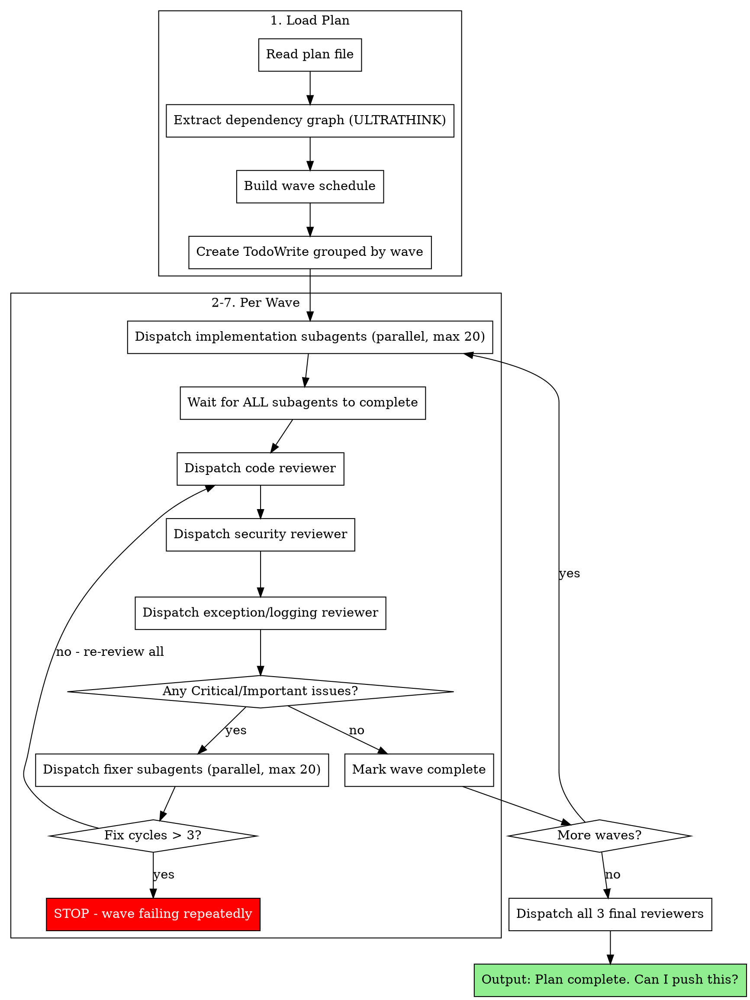

# Subagent-Driven Development

**Core principle:** Parallel implementation waves + triple review (code/security/exceptions) + parallel fix waves = fast, secure, robust iteration

## When to Use

Use this skill when:
- You have a written implementation plan (from writing-plans)
- Plan has Dependencies and Conflicts fields per task
- Tasks can be grouped into waves based on dependencies
- You want parallel execution with rigorous review

Don't use when:
- No plan exists (use writing-plans first)
- Single-task change (just implement it)
- Research/exploration task (use explore agent)

## The Process

### Phase 1: Load Plan

1. Read plan file from specified path
2. Extract dependency graph from `Dependencies:` and `Conflicts with:` fields
3. Use **ULTRATHINK** to analyze dependencies and build wave schedule
4. Validate: no circular dependencies, max 20 tasks per wave
5. Create TodoWrite grouped by wave
6. Display wave breakdown to user

### Phase 2: Implementation Wave

- Dispatch up to 20 implementation subagents in parallel (one per task)
- Each uses `./implementer-prompt.md` template with ULTRATHINK
- Each subagent: research → TDD → implement → test → commit
- Wait for ALL subagents to complete before proceeding
- Mark all wave tasks as in_progress, then completed

### Phase 3: Code Review Wave

- Dispatch SINGLE code-reviewer subagent (needs holistic view)
- Uses `superpowers:requesting-code-review` skill
- Runs full test suite (`{TEST_COMMAND}` from plan)
- Checks for false positive tests
- Validates wave dependencies (no conflicts)
- Standard code quality review
- **DOES NOT FIX - ONLY REPORTS**
- Uses **ULTRATHINK**
- Returns: Test results, false positives, issues by severity, "Ready for next wave?" verdict

### Phase 4: Security Review Wave

- Dispatch SINGLE security-reviewer subagent
- Uses `./security-reviewer-prompt.md` template
- Checks:
  1. Multi-tenancy & authorization (every query scoped)
  2. Injection vulnerabilities (SQL, command, XSS)
  3. Input validation (all user input validated)
  4. Authentication & session security
  5. Secrets & credentials (no hardcoded, no exposed)
  6. **Gitignore & sensitive files** (sessions, .env, credentials)
  7. Rate limiting (abuse prevention)
  8. File & path security (no traversal)
  9. Error handling (no info disclosure)
  10. Cryptography (strong algorithms)
  11. Third-party dependencies
- **DOES NOT FIX - ONLY REPORTS**
- Uses **ULTRATHINK**
- Returns: Risk level, multi-tenancy status, gitignore audit, issues by severity, "Ready for next wave?" verdict

### Phase 5: Exception & Logging Review Wave

- Dispatch SINGLE exception-logging-reviewer subagent
- Uses `./exception-logging-reviewer-prompt.md` template
- Checks:
  1. **No silent failures** (empty catch blocks are bugs)
  2. **No swallowed exceptions** (catch with only return/continue)
  3. **Logging has context** (IDs, operation, input in every log)
  4. **State updated on error** (status fields reflect failures)
  5. **Error propagation** (errors bubble up correctly)
  6. **User-friendly errors** (users see helpful messages, logs have details)
- **DOES NOT FIX - ONLY REPORTS**
- Uses **ULTRATHINK**
- Returns: Silent failure count, missing logging, state issues, "Ready for next wave?" verdict

### Phase 6: Fix Wave (If Needed)

- Only triggered if Critical or Important issues from ANY reviewer
- Parse ALL three reviewer outputs for actionable issues
- Dispatch parallel fixer subagents (max 20, one per issue)
- Each uses `./fixer-prompt.md` template with ULTRATHINK
- Each fixer: research → fix ONE specific issue → test → commit
- After all fixers complete, re-run ALL THREE reviews
- Repeat fix cycle until all reviewers say "Ready for next wave"
- **Fix cycle limit:** Stop after 3 cycles. If still failing, halt and report to user.

### Phase 7: Next Wave

1. Mark wave tasks complete in TodoWrite
2. Update wave counter
3. Return to Phase 2 for next wave

### Phase 8: Final Review

After all waves complete, dispatch all three final reviewers:
1. **Final code reviewer** - Holistic review, full test suite, architecture coherence, cross-wave integration
2. **Final security reviewer** - Complete security audit of all changes
3. **Final exception/logging reviewer** - No silent failures in entire codebase

All use **ULTRATHINK** and verify all plan requirements met.

### Phase 9: Complete

Output: `Plan complete. All [N] tasks implemented, [X] tests passing, 0 security issues, 0 silent failures. Can I push this?`

Wait for user confirmation before pushing.

## Flowchart



## Constraints

- **Max 20 parallel subagents** per wave (implementation or fixers)
- **Single reviewer per wave** (needs holistic view of all changes)
- **No proceeding with Critical/Important issues** from any reviewer
- **Minor issues** noted but don't block wave progression
- **All three reviewers must pass** before next wave
- **Fix cycle limit: 3** - halt if wave fails repeatedly

## Red Flags - Never Do This

- Never skip review between waves
- Never proceed with unfixed Critical/Important issues from any reviewer
- Never dispatch more than 20 parallel subagents
- Never let reviewers fix issues (they only report)
- Never push without user confirmation
- Never ignore silent failures (empty catch blocks)
- Never ignore gitignore issues (sessions tracked = critical)
- Never accept logs without context (must have IDs, operation, input)

## Prompt Templates

- `./implementer-prompt.md` - Implementation subagent (ULTRATHINK + research + error handling)
- Use `superpowers:requesting-code-review` for code reviewer
- `./security-reviewer-prompt.md` - Security reviewer (ULTRATHINK + gitignore)
- `./exception-logging-reviewer-prompt.md` - Exception/logging reviewer (ULTRATHINK + silent failures)
- `./fixer-prompt.md` - Fixer subagent (ULTRATHINK + research)

## Example Workflow

```
You: I'm using Subagent-Driven Development to execute this plan.

[Read plan: docs/plans/user-auth.md]
[ULTRATHINK: Analyze dependencies]
[Build wave schedule:]
  Wave 1: Tasks 1, 2, 3 (independent)
  Wave 2: Tasks 4, 5 (depend on Wave 1)
  Wave 3: Task 6 (depends on Task 4)
[Create TodoWrite grouped by wave]

=== Wave 1 ===

[Read docs/plans/user-auth.md lines 15-45 - Task 1]
[Read docs/plans/user-auth.md lines 46-78 - Task 2]
[Read docs/plans/user-auth.md lines 79-110 - Task 3]

Dispatching 3 implementation subagents in parallel:
  - Subagent A: Task 1 (User model)
  - Subagent B: Task 2 (Auth controller)
  - Subagent C: Task 3 (Middleware)

[Wait for all to complete...]

Subagent A: Done, 5 tests passing, committed
Subagent B: Done, 8 tests passing, committed
Subagent C: Done, 3 tests passing, committed

[Dispatch code reviewer]
Code Reviewer:
  Test Results: 16/16 passing
  False Positives: None detected
  Dependency Issues: None
  Issues:
    Important: Missing rate limiting in auth controller
  Ready for next wave? No - needs fixes

[Dispatch security reviewer]
Security Reviewer:
  Risk Level: High
  Multi-tenancy: Issues Found
  Gitignore: Missing entries
  Issues:
    Critical: User::find($id) without org scoping in controller
    High: Missing authorization policy on update
    High: sessions/ directory not in .gitignore
  Ready for next wave? No - needs fixes

[Dispatch exception/logging reviewer]
Exception Reviewer:
  Silent Failures: 1 CRITICAL
  Issues:
    Critical: Empty catch block in AuthController:89
    Important: Log::error without context in UserService:45
  Ready for next wave? No - has silent failures

[Dispatch 4 fixer subagents in parallel]
Fixer A: Added rate limiting, tests updated, committed
Fixer B: Fixed scoping + added policy, tests updated, committed
Fixer C: Added sessions/ to .gitignore, verified not tracked, committed
Fixer D: Added logging to catch block + context to Log::error, committed

[Re-review: all 3 reviewers]
Code Reviewer: 18/18 passing, no issues
Security Reviewer: Risk Level Low, gitignore complete, no issues
Exception Reviewer: No silent failures, logging complete
All ready for next wave? Yes

[Mark Wave 1 complete]

=== Wave 2 ===

[Dispatch 2 implementation subagents in parallel]
...

=== Final Review ===

[Dispatch all 3 final reviewers]

Code Reviewer:
  Test Results: 42/42 passing
  All requirements met
  Architecture coherent

Security Reviewer:
  Risk Level: Low
  Multi-tenancy: Secure
  All queries properly scoped
  Gitignore: Complete
  No vulnerabilities detected

Exception/Logging Reviewer:
  Silent Failures: 0
  All catch blocks log or rethrow
  All logs have context
  State updated on all error paths

Plan complete. All 6 tasks implemented, 42 tests passing, 0 security issues, 0 silent failures. Can I push this?
```
