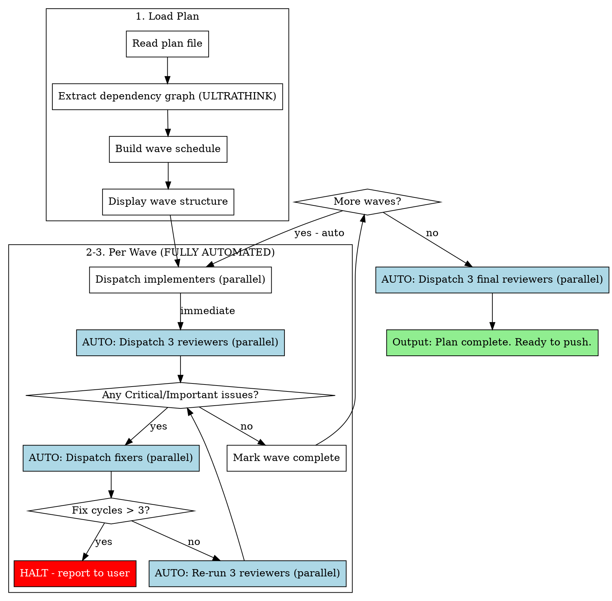

# Subagent-Driven Development

**Core principle:** Parallel implementation waves + triple review (code/security/exceptions) + parallel fix waves = fast, secure, robust iteration

## When to Use

Use this skill when:
- You have a written implementation plan (from writing-plans)
- Plan has Dependencies and Conflicts fields per task
- Tasks can be grouped into waves based on dependencies
- You want parallel execution with rigorous review

Don't use when:
- No plan exists (use writing-plans first)
- Single-task change (just implement it)
- Research/exploration task (use explore agent)

## The Process

### Phase 1: Load Plan

1. Read plan file from specified path
2. Extract dependency graph from `Dependencies:` and `Conflicts with:` fields
3. Use **ULTRATHINK** to analyze dependencies and build wave schedule
4. Validate: no circular dependencies, max 20 tasks per wave
5. Create TodoWrite grouped by wave
6. Display wave breakdown to user

### Phase 2: Automated Wave Execution

**This is a FULLY AUTOMATED cycle. NO manual intervention.**

For each wave:

1. **Implementation** (parallel)
   - Dispatch up to 20 implementation subagents in parallel (one per task)
   - Use direct parallel Task calls (NOT background), wait for all to complete
   - Each uses `./implementer-prompt.md` template with ULTRATHINK
   - Each subagent: research → TDD → implement → test → commit
   - Mark all wave tasks as in_progress, then completed

2. **Triple Review** (AUTOMATIC, all 3 in parallel)
   - IMMEDIATELY after implementation completes, dispatch ALL 3 reviewers in parallel
   - NO manual intervention - this happens automatically
   - Use direct parallel Task calls (NOT background), wait for all to complete

   **Code Reviewer** (superpowers:code-reviewer subagent):
   - Uses `superpowers:requesting-code-review` skill
   - Runs full test suite (`{TEST_COMMAND}` from plan)
   - Checks for false positive tests
   - Validates wave dependencies (no conflicts)
   - Standard code quality review
   - **DOES NOT FIX - ONLY REPORTS**
   - Uses **ULTRATHINK**
   - Returns: Test results, false positives, issues by severity

   **Security Reviewer** (Task subagent):
   - Uses `./security-reviewer-prompt.md` template
   - Checks: Multi-tenancy, injection, validation, auth, secrets, gitignore, rate limiting, file security, error handling, crypto, dependencies
   - **DOES NOT FIX - ONLY REPORTS**
   - Uses **ULTRATHINK**
   - Returns: Risk level, multi-tenancy status, gitignore audit, issues by severity

   **Exception/Logging Reviewer** (Task subagent):
   - Uses `./exception-logging-reviewer-prompt.md` template
   - Checks: No silent failures, no swallowed exceptions, logging has context, state updated on error, error propagation, user-friendly errors
   - **DOES NOT FIX - ONLY REPORTS**
   - Uses **ULTRATHINK**
   - Returns: Silent failure count, missing logging, state issues

3. **Auto-Fix Cycle** (AUTOMATIC if issues found)
   - Parse ALL three reviewer outputs
   - If ANY Critical or Important issues found:
     - AUTOMATICALLY dispatch parallel fixer subagents (max 20, one per issue)
     - Use direct parallel Task calls (NOT background), wait for all to complete
     - Each uses `./fixer-prompt.md` template with ULTRATHINK
     - Each fixer: research → fix ONE specific issue → test → commit
     - After all fixers complete, AUTOMATICALLY re-run ALL THREE reviews in parallel
     - Repeat until all reviewers pass OR 3 cycles reached
   - If 3 fix cycles reached and still failing: HALT and report to user
   - If only Minor issues OR test failures unrelated to changes: User interruption allowed, otherwise AUTO-FIX

### Phase 3: Next Wave

1. Mark wave tasks complete in TodoWrite
2. Update wave counter
3. AUTOMATICALLY return to Phase 2 for next wave (NO manual intervention)

### Phase 4: Final Review

After all waves complete, AUTOMATICALLY dispatch all three final reviewers IN PARALLEL:
1. **Final code reviewer** (superpowers:code-reviewer) - Holistic review, full test suite, architecture coherence, cross-wave integration
2. **Final security reviewer** (Task subagent) - Complete security audit of all changes
3. **Final exception/logging reviewer** (Task subagent) - No silent failures in entire codebase

All use **ULTRATHINK** and verify all plan requirements met.

### Phase 5: Complete

Output: `Plan complete. All [N] tasks implemented, [X] tests passing, 0 security issues, 0 silent failures.`

**NEVER push automatically. Wait for user to decide.**

## Wave Visualization Format

Display wave structure EXACTLY like this at the start:

```
Wave 1
  ├─ Task 1: [task description]
  ├─ Task 2: [task description]
  └─ Task 3: [task description]

Wave 2 (depends on Wave 1)
  ├─ Task 4: [task description]
  └─ Task 5: [task description]

Wave 3 (depends on Task 4)
  └─ Task 6: [task description]

Wave 4
  └─ Task 7: [verification task]
```

**NO "Waiting for..." or "Dispatching..." messages. Just dispatch and wait.**

## Flowchart



## Constraints

- **Max 20 parallel subagents** per wave (implementation or fixers)
- **All 3 reviewers run in parallel** (code, security, exception/logging)
- **Direct parallel dispatch** (NOT background + wait pattern)
- **No proceeding with Critical/Important issues** from any reviewer
- **Minor issues** noted but don't block wave progression
- **All three reviewers must pass** before next wave
- **Fix cycle limit: 3** - halt if wave fails repeatedly
- **FULLY AUTOMATED** - no manual intervention between waves

## Red Flags - Never Do This

- **NEVER push automatically** - ALWAYS wait for user confirmation
- **Never wait for manual "continue" between waves** - process is fully automated
- **Never dispatch reviewers sequentially** - all 3 in parallel ALWAYS
- **Never use background dispatch** - use direct parallel Task calls
- Never skip review between waves
- Never proceed with unfixed Critical/Important issues from any reviewer
- Never dispatch more than 20 parallel subagents
- Never let reviewers fix issues (they only report)
- Never ignore silent failures (empty catch blocks)
- Never ignore gitignore issues (sessions tracked = critical)
- Never accept logs without context (must have IDs, operation, input)
- **Never announce "Waiting for..." or "Dispatching..." - just do it**

## Prompt Templates

- `./implementer-prompt.md` - Implementation subagent (ULTRATHINK + research + error handling)
- Use `superpowers:requesting-code-review` for code reviewer
- `./security-reviewer-prompt.md` - Security reviewer (ULTRATHINK + gitignore)
- `./exception-logging-reviewer-prompt.md` - Exception/logging reviewer (ULTRATHINK + silent failures)
- `./fixer-prompt.md` - Fixer subagent (ULTRATHINK + research)

## Example Workflow

```
You: I'm using Subagent-Driven Development to execute this plan.

[Read plan: docs/plans/user-auth.md]
[ULTRATHINK: Analyze dependencies]

Wave 1
  ├─ Task 1: Create User model with org scoping
  ├─ Task 2: Add AuthController with rate limiting
  └─ Task 3: Create auth middleware

Wave 2 (depends on Wave 1)
  ├─ Task 4: Add password reset flow
  └─ Task 5: Create 2FA implementation

Wave 3 (depends on Task 4)
  └─ Task 6: Add email verification

=== Wave 1 ===

[Dispatch 3 implementers in parallel]
✓ Task 1: User model - 5 tests passing
✓ Task 2: Auth controller - 8 tests passing
✓ Task 3: Middleware - 3 tests passing

[AUTO: Dispatch 3 reviewers in parallel - code, security, exception/logging]

Triple Review Results:
  Code: 16/16 passing, 1 Important issue
  Security: Risk High, 3 Critical/High issues
  Exception: 2 Critical/Important issues

[AUTO: Dispatch 4 fixers in parallel]
✓ Fixer 1: Added rate limiting
✓ Fixer 2: Fixed org scoping + added policy
✓ Fixer 3: Updated .gitignore
✓ Fixer 4: Fixed catch block + logging context

[AUTO: Re-review with 3 reviewers in parallel]
  Code: 18/18 passing, no issues
  Security: Risk Low, no issues
  Exception: No silent failures, logging complete

Wave 1 complete ✓

=== Wave 2 ===

[AUTO: Dispatch 2 implementers in parallel]
✓ Task 4: Password reset - 12 tests passing
✓ Task 5: 2FA - 8 tests passing

[AUTO: Dispatch 3 reviewers in parallel]
  Code: 38/38 passing, no issues
  Security: Risk Low, no issues
  Exception: No silent failures

Wave 2 complete ✓

=== Wave 3 ===

[AUTO: Dispatch 1 implementer]
✓ Task 6: Email verification - 4 tests passing

[AUTO: Dispatch 3 reviewers in parallel]
  Code: 42/42 passing, no issues
  Security: Risk Low, no issues
  Exception: No silent failures

Wave 3 complete ✓

=== Final Review ===

[AUTO: Dispatch 3 final reviewers in parallel]

Code: 42/42 passing, all requirements met, architecture coherent
Security: Risk Low, multi-tenancy secure, gitignore complete
Exception: No silent failures, all logs have context

Plan complete. All 6 tasks implemented, 42 tests passing, 0 security issues, 0 silent failures. Ready to push.
```

**Note:** Entire process runs automatically with NO manual intervention between waves. User stops/decisions only at:
1. If 3 fix cycles reached without passing reviews (HALT - requires user decision)
2. If test failures clearly unrelated to changes (user can approve continuation)
3. After completion (NEVER auto-push - user decides whether to push)
