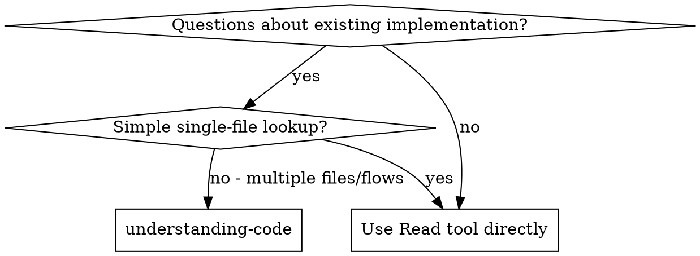
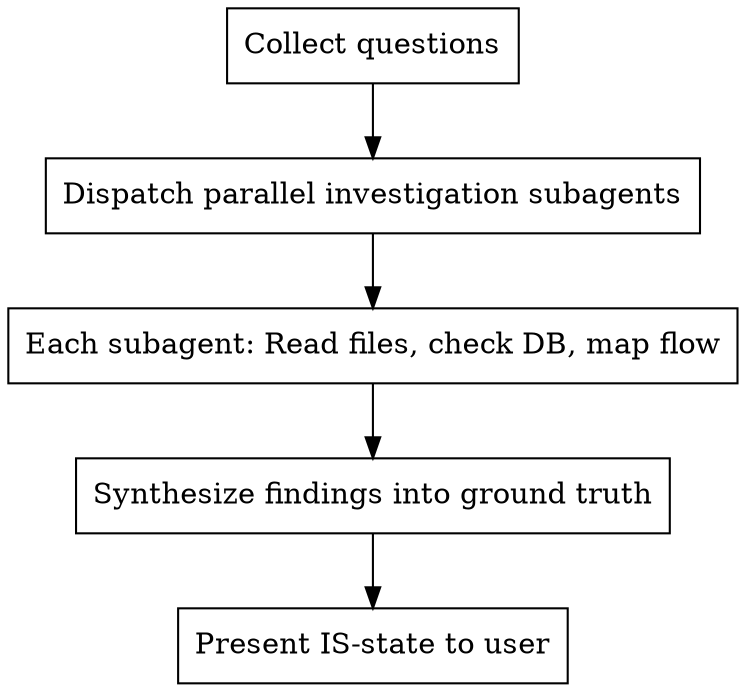

# Understanding Code

## Overview

**Dispatch parallel subagents to investigate code, one per question. Get ground truth, not assumptions.**

When understanding complex features, don't guess - investigate. Each question gets its own subagent that reads actual files, checks DB schema, and maps logic flows.

## When to Use

**Use when:**
- "How does X feature work?"
- "What's the current implementation of Y?"
- "Are these flows differentiated?"
- "How is status/state tracked?"
- Multiple related questions about same feature
- Need ground truth before planning changes

**Don't use for:**
- Single file lookup (use Read directly)
- Known simple implementations
- Writing new code (use brainstorming first)

## The Process

## Red Flags

**Never:**
- Assume code works as documented
- Skip checking actual DB schema
- Read one file and extrapolate
- Answer questions without reading code
- Trust variable names over actual behavior

**If you catch yourself:**
- "I think it works like..." → STOP, dispatch subagent to check
- "Based on the migration..." → STOP, check actual schema
- "It probably uses..." → STOP, read the actual code
